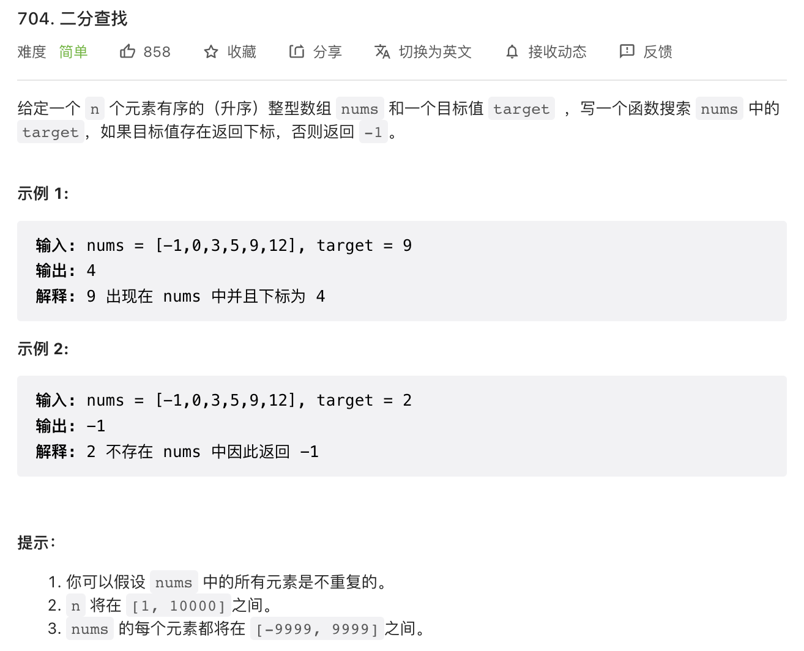
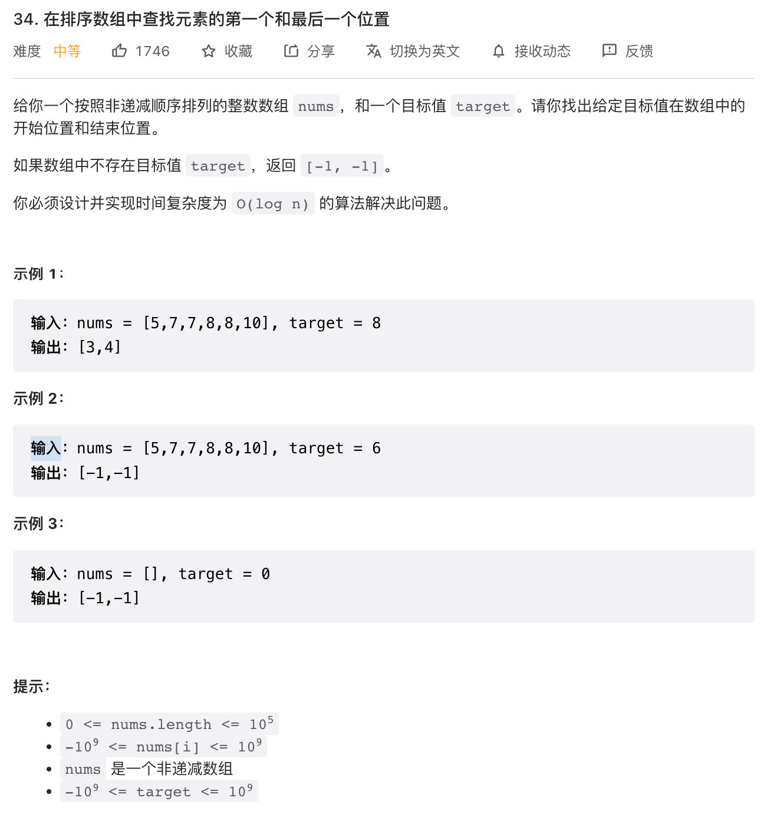

### 普通的二分查找

见 Leetcode 第 704 题 [二分查找](https://leetcode.cn/problems/binary-search/)



下面是题解：

```JavaScript
// O(logn) / O(1)
function search(nums, target) {
    let left = 0;
    let right = nums.length - 1;

    // 判断条件为什么不是 < 呢？为了处理数组只有一个元素的情况，例如：nums = [1], target = 1
    while (left <= right) {
        // 1）避免大数相加 2）利用位运算符提高性能
        const mid = left + ((right - left) >> 1);
        const num = nums[mid];

        if (num === target) {
            return mid;
        } else if (num < target) {
            left = mid + 1;
        // 明确判断条件（看个人喜好）
        } else if (num > target) {
            right = mid - 1;
        }
    }

    return -1;
}
```

### 寻找左侧边界的二分查找

见 LeetCode 第 34 题 [在排序数组中查找元素的第一个和最后一个位置](https://leetcode.cn/problems/find-first-and-last-position-of-element-in-sorted-array/)，这道题同时包含了寻找左侧边界和右侧边界。



先来看看寻找左侧边界，下面是题解：

```JavaScript
// O(logn) / O(1)
function findLeftIndex(nums, target) {
    let left = 0;
    let right = nums.length - 1;

    while (left <= right) {
        const mid = left + ((right - left) >> 1);
        const num = nums[mid];

        if (num < target) {
            left = mid + 1;
        } else if (num >= target) {
            right = mid - 1;
        }
    }

    return nums[left] === target ? left : -1;
}
```

为了方便理解，以 `nums = [5,7,7,8,8,10], target = 8` 为例，下面是 index 和对应的 num：

```
0 1 2 3 4 5
5 7 8 8 8 10
```

关键是 while 中的条件判断：

- 当 `num < target` 时，整个 target 区间在 mid 的右边，向右缩小范围：`left = mid + 1`
- 当 `num > target` 时，整个 target 区间在 mid 的左边，向左缩小范围：`right = mid - 1`
- 当 `num === target` 时，为什么也是 `right = mid - 1` 呢？因为结合 while 循环的判断条件，我们可以让 right 落在左侧边界左边的元素上，而 left 正好落在左侧边界上。最后通过 `nums[left] === target` 判断 target 区间是否存在

### 寻找右侧边界的二分查找

寻找右侧边界的也是类似的，最终让 left 落在右侧边界右边的元素上，而 right 正好落在右侧边界上：

```JavaScript
function findRightIndex(nums, target) {
    let left = 0;
    let right = nums.length - 1;

    while (left <= right) {
        const mid = left + ((right - left) >> 1);
        const num = nums[mid];

        if (num <= target) {
            left = mid + 1;
        } else if (num > target) {
            right = mid - 1;
        }
    }

    return nums[right] === target ? right : -1;
}
```
