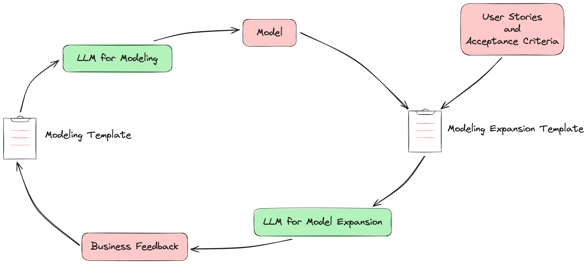
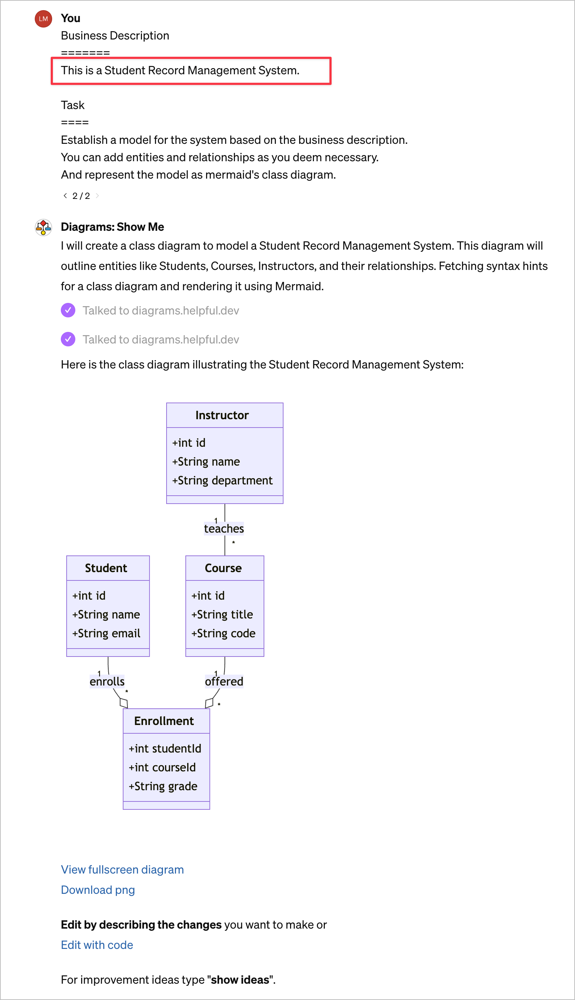
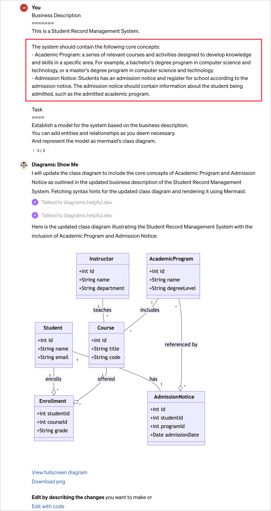

> For LLM, the focus is not on doing it, but on verifying that what he did is right.

---

- [Construct the feedback loop](#construct-the-feedback-loop)
- [Example](#example)
- [Summary](#summary)

---

At first glance, it seems quite simple. Just give some context and ask LLM to generate the model. But can you fully trust the model generated by LLM❓

The key is not to get the model but to get the right model. Therefore, we need to construct a feedback loop to verify the model.

## Construct the feedback loop

We need the following components to construct the feedback loop:

- 2 LLMs
  - `LLM for Modeling` - Generate the model with the given context
  - `LLM for Model Expansion` - Expand the model to explain the business context
- 2 templates
  - `Modeling Template`
  - `Model Checking Template`
- `User Stories` and `Acceptance Criteria`

The feedback loop is as follows:



But it is impossible to get the correct model the first time. There are 2 problems here:

- Missing concepts - We may be missing concepts that are mentioned in `User Stories` or other business contexts.
- Misplaced relationships - The relationship between objects in the model may be incorrect.

To solve these problems, we need to add a new LLM and template:

- `LLM for Model Checking`
- `Model Expansion Template`

Below is the improved feedback loop:


The three templates we use are as follows:

**Modeling Template**

```plain
Business Description
=======
{{ CONTEXT }}

Task
====
Establish a model for the system based on the business description.
You can add entities and relationships as you deem necessary.
And represent the model as a mermaid's class diagram.
```

> We use [Mermaid](https://mermaid.js.org/) for describing the domain model.

**Model Checking Template**

```plain
Domain Model
======
// Mermaid syntax
{{ MODEL }}

# User Stories
{{ USER STORY }}

# Acceptance Criteria
{{ AC }}

# Task
====
What concepts are missing from the domain model for this User Story and Acceptance Criteria? Or what incorrect relationships exist.
Please express in words what is the missing concept. and what incorrect associations exist.
```

**Model Expansion Template**

```plain
# Domain Model
// Mermaid syntax
{{ MODEL }}

# User Stories
{{ USER STORY }}

# Acceptance Criteria
{{ AC }}

# Task
====
The data are all given in YAML format.
First, please understand the scenarios in the User Story based on the domain model, and provide sample data for the Given part of the acceptance scenario.
Then, refer to the When part of the Acceptance Criteria to give how the sample data will change.
```

## Example

Take the Student Record Management System as an example, the business description is as follows:

- **The college** offers different **academic programs**.
- Different **academic programs** have corresponding **curriculum**.
- **The college** issues **admission notices** to students, informing them of which **academic program** they have been admitted to.
- **Students** will be registered in the designated **academic program** according to the **admission notice**.
- **Students** need to choose **courses** according to the **curriculum** during the period of validity of their student status.

One of the `User Stories` (using [As a, I want, So that](https://www.agilealliance.org/glossary/user-story-template/) style) can be:

```plain
- As a faculty,
- I want the student to be able to enrol in an academic program with a given offer
- So that I can track their progress
```

The corresponding `Acceptance Criteria` (using [Given-When-Then](https://martinfowler.com/bliki/GivenWhenThen.html) style) is:

```plain
- Given student with the offer hasn't enrolled in any program
- When the student enrols
- Then the student will successfully enrol the program specified in the offer
```

### Modeling

First, add a business description to the `Modeling Template`:

```
This is a Student Record Management System.
```

> For demonstration purposes, I added a simple business description. In actual use, you need to add a more detailed description. More context yields better results.

**Q&A**



> Used [Diagrams: Show Me](https://chat.openai.com/g/g-5QhhdsfDj-diagrams-show-me) GPT and you can get the domain model in the link in the answer.

As you can see, the result is far from our business description. It's obviously missing the concepts of "**Academic Program**" and "**Offer**" mentioned in the `User Story` and `Acceptance Criteria`. This is because we did not provide a detailed business description. Next, we will use the `Model Checking Template` to refine the model.

### Model Checking

Fill in the `Model Checking Template` and ask in a new chat.

**Q&A**


Let's be humble and take the feedback. We can add the missing concepts "**Academic Program**" and "**Admission Notice (Offer)**" to the `Modeling Template` and ask again.

**Q&A**



The model is much better. We can ignore the suggestions for relationships as they are not our focus. You can also continue to do the model checking with the updated domain model.

### Model Expansion

Model expansion is to instantiate the concepts in the model in a given business context. Explain what is happening in the business through instantiated models. This is a reverse verification.

**Q&A**


## Summary


Here are the steps for modelling with LLM:

1. Give a general description of the system and use LLM to generate a model.
2. Use LLM to verify the completeness of the model and propose missing concepts.
3. Add the missing concepts and then re-generate the model.
4. Repeat the steps 2 and 3 until the model meets your expectations.
5. Use LLM to expand the model to do reverse verification.
